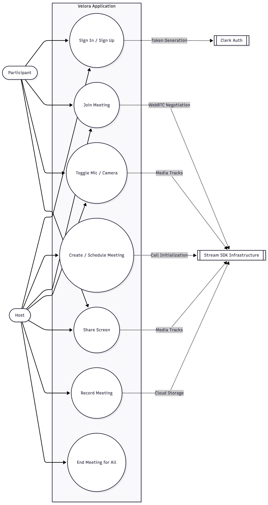
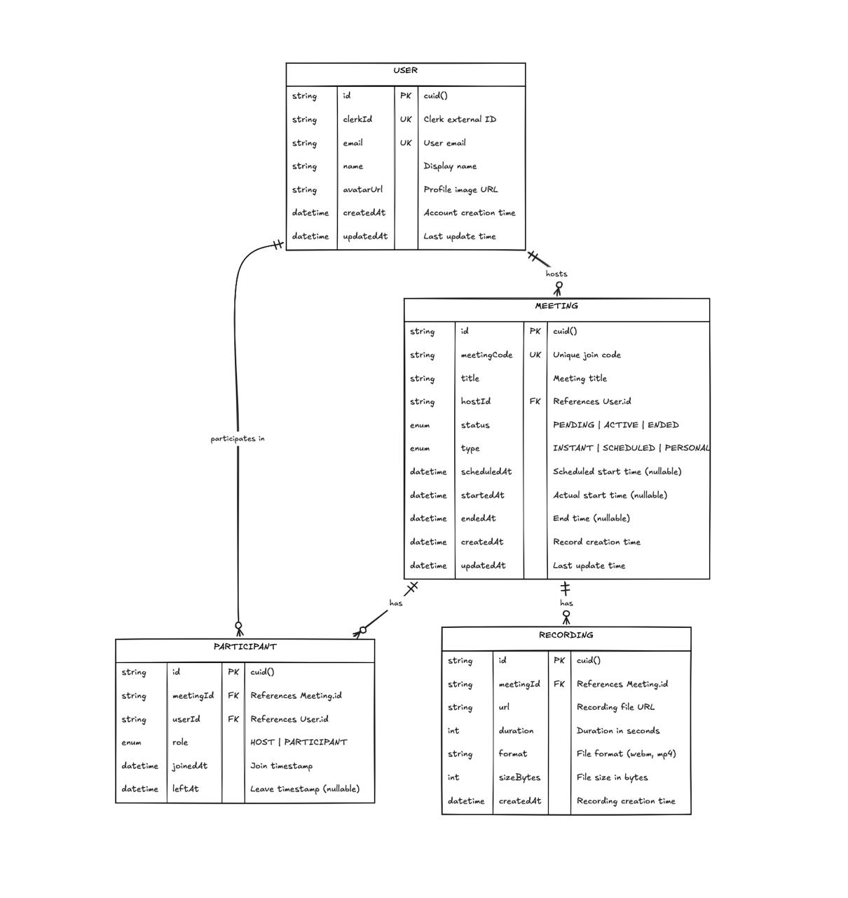

# Velora — Video Conferencing Platform: Comprehensive Project Report

## 1. Executive Summary
**Velora** is a modern, scalable, peer-to-peer video conferencing application designed as a highly performant "Zoom clone". It enables users to create and join real-time video meetings seamlessly. The project was meticulously architected using strict Object-Oriented TypeScript, integrating advanced real-time communication technologies such as native WebRTC and WebSocket signaling.

The application was built following a rigorous execution plan focused on System Design, Backend Signaling, Frontend WebRTC Integration, and QA Optimization.

## 2. System Architecture & Tech Stack
The platform utilizes a modern full-stack JavaScript/TypeScript ecosystem to deliver a seamless real-time experience.

| Layer | Technology | Purpose |
|-------|------------|---------|
| **Frontend** | Next.js 16 (App Router), React 19, Tailwind CSS 4 | User interface, routing, styling, and component architecture. |
| **Backend** | Node.js, Express.js | REST API, static asset serving, and server bootstrapping. |
| **Signaling** | Socket.io | Bi-directional, real-time communication for WebRTC signaling. |
| **Real-time Video** | Native WebRTC | P2P mesh topology for ultra-low latency audio/video streaming. |
| **Database & ORM**| PostgreSQL, Prisma | Persistent storage for users, meeting metadata, and historical records. |
| **Authentication**| Clerk | Secure SSO, JWT validation, and user session management. |

### Project Directory Structure
The architecture is logically separated into decoupled frontend and backend workspaces:

**Backend (`/backend`)**
* `src/index.ts`: Express + Socket.io entry point.
* `src/config/`: Database, CORS, env configuration.
* `src/middleware/`: Auth (Clerk JWT), error handling, validation.
* `src/routes/ & controllers/`: REST API routing and logic.
* `src/signaling/`: WebRTC signaling server (`socket-server.ts`, `room-manager.ts`).
* `src/patterns/`: Design patterns implementations.

**Frontend (`/frontend`)**
* `app/`: Next.js App Router for `(auth)`, `(root)`, and `meeting/[id]`.
* `components/`: Modular React components (`VideoTile`, `MeetingRoom`, `MediaControls`).
* `hooks/`: Custom React hooks (`useWebRTC`, `useSocket`, `useMediaStream`).
* `store/`: Zustand state management store.
* `lib/`: API client and utility functions.

## 3. System Design & Architectural Diagrams
The project was designed using standard system design principles. The following conceptual models define the architecture:

### 3.1 Use Case Mapping
The **Use Case Diagram** describes the actor-action mapping and features available to users, such as authentication, creating meetings, joining rooms, toggling media, and leaving.

### 3.2 Database Schema (ERD)
The **Entity-Relationship Diagram** represents the database schema mapped via Prisma to PostgreSQL. It defines relations between `Users` and `Meetings` to track meeting ownership and participants.

### 3.3 WebRTC Signaling Flow
The **Sequence Diagram** demonstrates the core WebRTC signaling flow and client-server interactions. It outlines how peers exchange SDP Offers, SDP Answers, and ICE candidates through the Socket.io intermediary to establish direct P2P media connections.

### 3.4 Object-Oriented Architecture
The **Class Diagram** outlines the design patterns and SOLID principles applied in the backend ecosystem to ensure loose coupling and high cohesion.

## 4. Design Patterns & SOLID Principles
Velora adheres strictly to **SOLID principles** and industry-standard design patterns to ensure scalability, maintainability, and code robustness.

* **Singleton Pattern:** 
  * `DatabaseClient`: Ensures only a single Prisma connection pool exists.
  * `SocketServer`: Maintains a single Socket.io instance globally to prevent redundant connections and memory leaks.
* **Observer Pattern:** 
  * Implemented in the `RoomManager`. It allows peers to subscribe to room events and get notified instantly of joins/leaves without tight coupling to the socket controllers.
* **Factory Pattern:** 
  * Utilized via `MeetingFactory` to seamlessly instantiate different configurations or types of meetings based on user requests.
* **Dependency Inversion:** Interfaces and abstract classes manage dependencies, making the system highly testable and loosely coupled.

## 5. Application Programming Interfaces (APIs)

### 5.1 REST API Endpoints
Used for persistent state management and application data:
* `POST /api/users/sync`: Sync user data from Clerk webhook.
* `GET /api/users/me`: Retrieve current authenticated user.
* `POST /api/meetings`: Create a new video meeting.
* `GET /api/meetings`: List all meetings for the user.
* `GET /api/meetings/:code`: Retrieve meeting details by unique code.
* `PATCH /api/meetings/:id/status`: Update meeting lifecycle status (active, ended).

### 5.2 WebSocket Signaling Events
Used for real-time WebRTC brokering and room management:
* **Client to Server (C→S):**
  * `join-room`, `leave-room`: Room lifecycle management.
  * `offer`, `answer`: Session Description Protocol (SDP) exchange.
  * `ice-candidate`: Network routing discovery exchange.
* **Server to Client (S→C):**
  * `room-users`: Payload of existing participants in the room.
  * `user-joined`: Notification of a new peer connection.
  * `user-left`: Notification of a peer disconnection.

## 6. Key Features & Implementation Details

### User Authentication & Security
Integrated with Clerk for zero-friction sign-ups and secure identity management. Middleware on the Node.js backend validates Clerk JWTs before granting access to protected REST endpoints or allowing WebSocket connections.

### Real-time WebRTC Communication
* **P2P Mesh Topology:** Clients connect directly to each other after initial signaling, reducing server bandwidth constraints and enabling ultra-low latency.
* **Signaling Server:** The custom Node.js backend efficiently brokers the exchange of session descriptions and ICE candidates.
* **Media Controls:** Custom React hooks (`useWebRTC`, `useMediaStream`) encapsulate the complexity of interacting with the browser's native `navigator.mediaDevices` API, allowing intuitive toggling of microphones, cameras, and screen sharing.

### Responsive UI/UX State Management
* Redesigned user interface utilizing the latest **Tailwind CSS 4**.
* Complex UI state across the application is managed via **Zustand**, ensuring that meeting status updates, participant lists, and media states are synchronized seamlessly across the Next.js application.

## 7. Conclusion
Velora stands as a robust, production-ready video conferencing application. By combining strict Object-Oriented principles, systemic design patterns, and cutting-edge web technologies like Next.js 16 and native WebRTC, the platform delivers a reliable, high-performance user experience comparable to leading commercial solutions.
